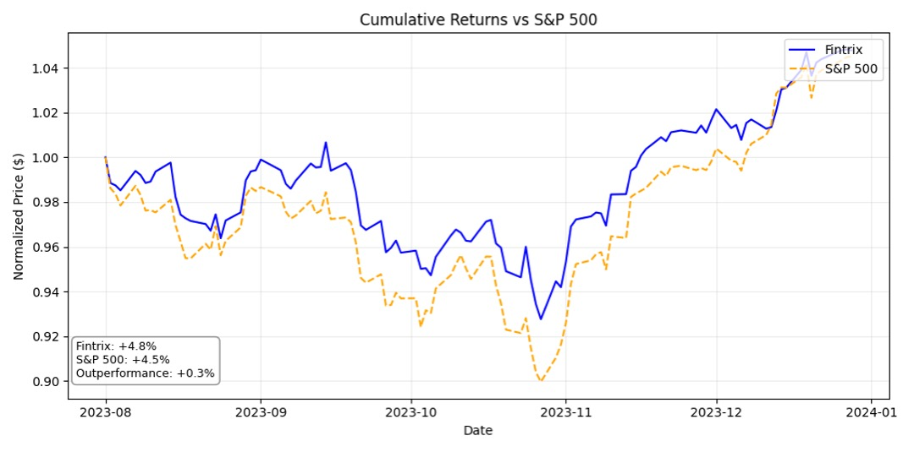
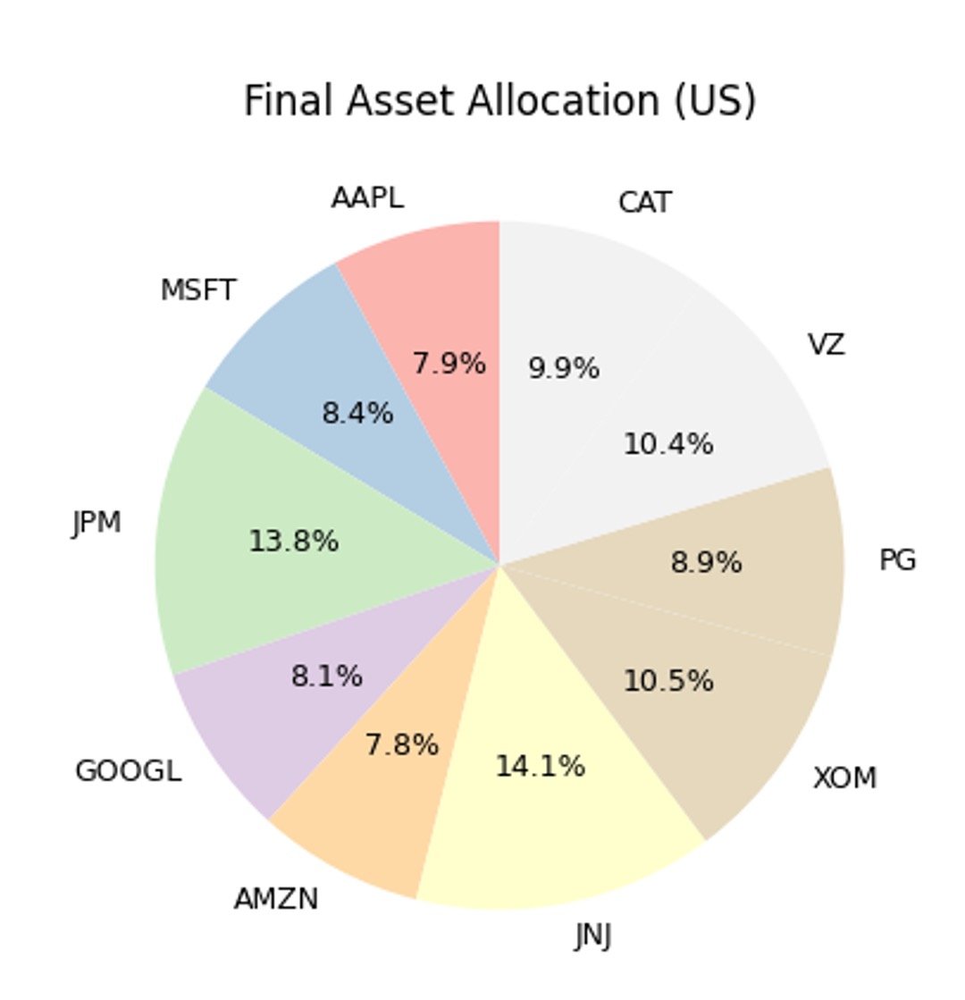

# QuantFlux: Reinforcement Learning Portfolio Optimization System

**QuantFlux** is a modular, research-grade framework for training and evaluating reinforcement learning-based portfolio allocation strategies. It is powered by Proximal Policy Optimization (PPO) and integrates synthetic financial data generation using Denoising Diffusion Probabilistic Models (DDPM). Designed to be interpretable, extensible, and robust, QuantFlux is an ideal tool for researchers, quants, and AI engineers looking to build smarter financial agents.

---

## 🚀 Core Objectives

* Generate realistic financial data via regime-aware DDPM models
* Learn dynamic portfolio strategies that adapt to changing market regimes
* Optimize allocations using advanced reinforcement learning methods (PPO)
* Incorporate real-world constraints: transaction costs, position limits, diversification
* Provide an explainable pipeline with regime attribution, allocation diagnostics, and benchmarking

---

## 🔍 Key Features

### Reinforcement Learning (PPO)

* Actor-critic architecture with clipped objective
* Supports stochastic policies and continuous action spaces (portfolio weights)

### Synthetic Data via DDPM

* Trains on regime-conditioned time series sequences
* Simulates different risk scenarios with volatility control
* Generates training environments that reflect real-world non-stationarity

### Market Regime Detection

* Real-time regime classification (bull, bear, volatile, sideways)
* Driven by rolling returns, volatility, and trend strength metrics
* Used to modulate both reward shaping and asset exposure

### Position Sizing & Timing

* Implements Kelly Criterion (multi-timeframe version)
* Dynamically adjusts exposure using market timing layer
* Enforces risk-aware soft and hard constraints (min/max allocation)

### Feature Engineering

* Momentum, volatility, SMA, RSI, trend score (per asset & market)
* Correlation matrix descriptors
* Regime indicators embedded in observations

### Rebalancing Engine

* Rebalances only when drift exceeds threshold or max holding time reached
* Transaction cost-aware allocation logic
* Penalizes overtrading and unnecessary weight shifts

### Benchmark-Aware Reward Function

* Encourages outperformance relative to index
* Penalizes volatility, drawdowns, and costs
* Promotes steady compounding rather than explosive bets

---

## 🧱 Repository Structure

```
QuantFlux/
├── assets/            # Charts, diagrams, performance outputs
├── config/            # Training configs and constants
├── data/              # Data loader, feature calculator, DDPM pipeline
├── ddpm/              # DDPM model, trainer, denoiser
├── env/               # Portfolio environment (Gymnasium-style)
├── market/            # Kelly sizing, market regimes, timing layer
├── models/            # PPO agent: policy & value nets
├── scripts/           # Faster execution script
├── utils/             # Plotting, logging, metrics
├── tests/             # Unit & integration tests
├── main.py            # Main entry point
├── requirements.txt   # Required libraries
└── README.md          # This file
```

---

## ✅ Installation

### Prerequisites:

* Python 3.10+

### Create Environment:

```bash
git clone https://github.com/yourusername/QuantFlux.git
cd QuantFlux
conda create -n QuantFlux python=3.10
conda activate QuantFlux
pip install -r requirements.txt
```

---

## 🧪 Running an Experiment

```bash
python main.py
```

This will:

* Detect your market region
* Download historical price data
* Train a DDPM to simulate financial time series
* Generate enhanced training sets
* Train a PPO agent using synthetic + real data
* Evaluate final policy on real data only
* Output performance metrics and plots

---

##  Sample Output

### Cumulative Returns



### Allocation Pie Chart



---

## 🔧 Configuration Overview

Edit `config/config.py`:

```python
SELECTED_TICKERS = ["AAPL", "MSFT", "AMZN", "GOOGL", "JPM", "XOM"]
BENCHMARK_INDEX = "^GSPC"
START_DATE = "2010-01-01"
END_DATE = "2024-01-01"
DDPM_EPOCHS = 50
RL_EPISODES = 200
MAX_POSITION_SIZE = 0.25
REBALANCE_THRESHOLD = 0.025
```

---

## 🧪 Unit Testing

```bash
pytest tests/
```

Includes:

* `test_env.py` — environment reset/step validation
* `test_ddpm.py` — DDPM forward shape check
* `test_ppo.py` — action, log-prob, value shape integrity

---

##  Future Extensions

* Incorporate **financial news and sentiment data** for context-aware allocation
* Add **multi-agent framework** (long-short strategies)
* Integrate **live broker APIs** (e.g. Alpaca, Zerodha Kite)
* Support **multi-objective RL** (risk-adjusted vs. absolute return)
* Add **experiment tracking tools** (W\&B, MLflow)

---

## ⚠️ Disclaimer

> QuantFlux is developed strictly for **educational and research purposes**.
>
> **Do NOT use QuantFlux for live or real-money trading.**
>
> There are no guarantees of future performance, reliability, or correctness. Use entirely at your own risk.

---

## 📄 License

MIT License. See [LICENSE](LICENSE) for full details.

---


* Email: [pratyush.baliarsingh2004@gmail.com](mailto:pratyush.baliarsingh2004@gmail.com)

